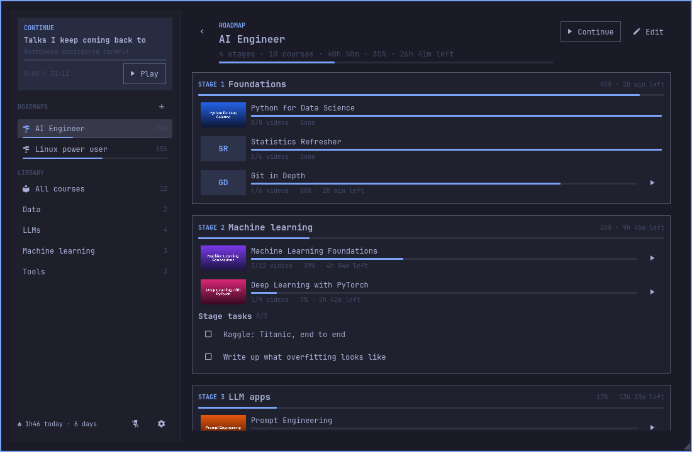
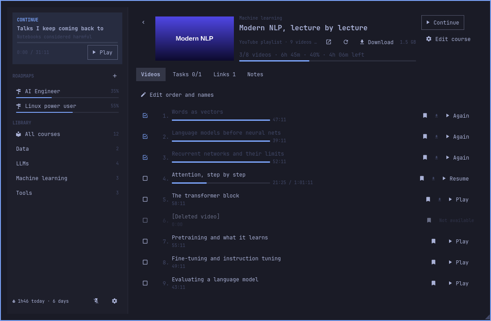
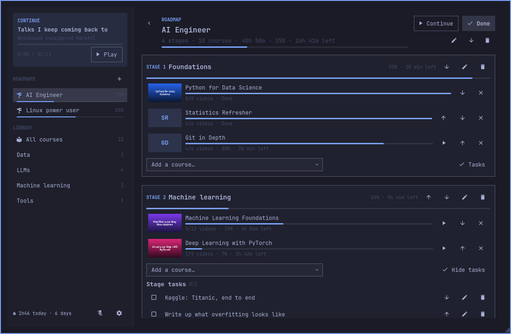
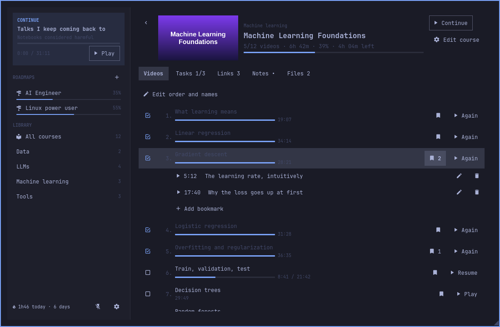
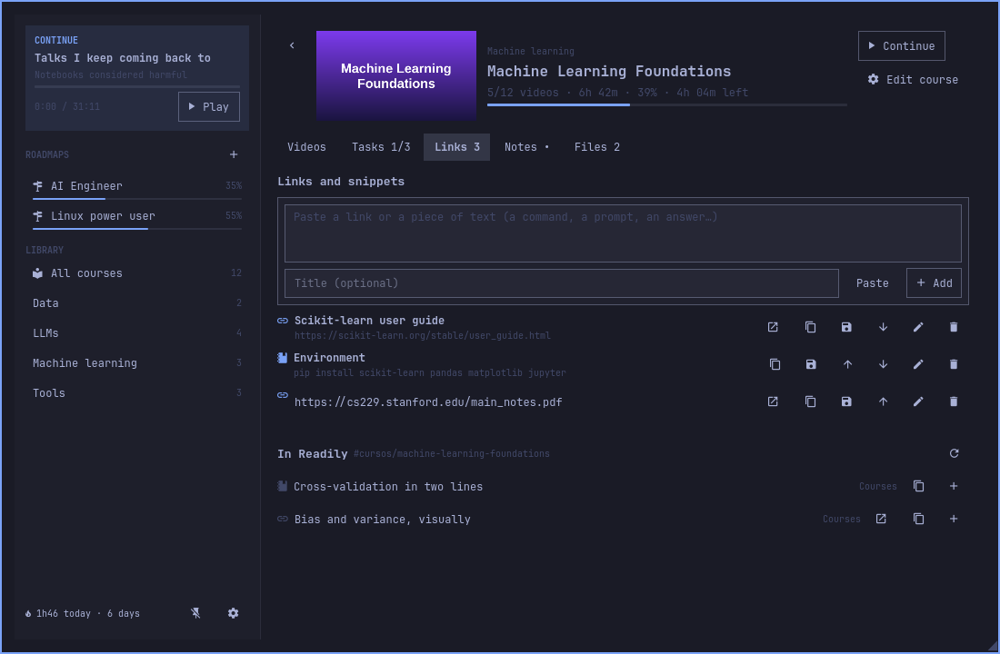

# Syllabus

Turn the video courses on your disk into study roadmaps, and pick up every video
exactly where you left it.



Courses saved to a disk are easy to start and hard to keep going with: which one
was next, where you stopped in a three-hour video, what you meant to try after
that lesson. Syllabus reads your course folders, never changes them, and adds
what they lack: an order to study them in, the second you stopped at in every
video, and a place for tasks, links, notes and bookmarks. Videos play in mpv.

## Install

```sh
omarchy plugin add https://github.com/FerC10110/omarchy-syllabus.git --enable
```

The bar gains a 󰑴 button, on the left unless you choose another place. Click it
to open the panel; right-click it to continue the last video.

Syllabus uses `mpv`, `ffprobe` (from ffmpeg), `wl-clipboard`, `xdg-utils` and
Python 3, all part of Omarchy. The [Readily](https://github.com/FerC10110/omarchy-readily)
plugin is optional.

## Your courses

Syllabus looks for courses in `~/Videos/Courses`. For another folder or an
external disk, set it in `~/.config/syllabus/config.json` (Settings has a button
that opens that folder):

```json
{ "roots": [{ "id": "main", "path": "/run/media/you/disk/courses" }] }
```

The first scan reads the length of every video with `ffprobe`, which can take a
minute on a slow disk; later scans only read new or changed videos. The panel
scans again on its own when you open it and the last scan is more than an hour
old, and **Rescan** in the library does it whenever you want.

How folders become courses:

- A folder with videos is a course. Videos in its subfolders are grouped under
  the subfolder's name.
- A folder with no videos of its own and two or more subfolders with videos is a
  collection: each subfolder is a course, and the folder is their topic.
- A folder with no videos of its own and a single subfolder with videos is one
  course.
- A number at the start of a file name sets the order (`2` comes before `10`)
  and is dropped from the title. A file named only by its recording date, or
  just like its course, shows as "Part 3".
- Videos shorter than a minute are hidden as probably broken. **Show hidden**
  brings them back.

**Edit course** changes the title, topic and cover, and how its folder splits
into courses. None of it touches the disk: your edits live in Syllabus's own
files.

The disk does not need to be mounted to browse, plan or take notes; only to
play. A video renamed or moved on the disk keeps its progress, title and
bookmarks if the very next scan sees the old file gone and the new one there
(same name and size, or the only file of that size).

## Courses from the web

Free courses live on YouTube and Vimeo too. **Add from the web**, next to Rescan,
takes a playlist, a Vimeo showcase or a single video and makes it a course like any
other: same progress, bookmarks, tasks, links, notes and roadmaps.



- Videos stream by default. **Download** keeps a whole course in
  `~/Videos/Syllabus`, and then it plays from there, with no internet.
- Playlists are read again once a day and with **Rescan**. A video that is taken
  down stays in the list as "Not available", with the progress you had.
- Only public or unlisted content: Syllabus never uses your browser's cookies. A
  Vimeo video with a password asks for it when you add it.
- A course is either from the disk or from the web, never both.

### Subtitles and audio

Settings has three options for web videos, and none of them touch the videos on
your disk:

| Setting | Default | What it does |
|---|---|---|
| Subtitle languages | `es, en` | Which subtitles to ask for; the first one you have is shown. Empty means none |
| Include automatic subtitles | on | YouTube's machine-made captions, when a video has no written ones |
| Audio language | empty | A code like `es` picks YouTube's dubbed audio; empty keeps the video's own |

They are the subtitles the site publishes with the video: nothing is looked up
anywhere else. A video without that dub plays with the audio it has, and the
audio language applies from the next video you open — a link's audio tracks
cannot be switched inside mpv.

## Roadmaps

A roadmap is a list of stages, each with its courses in order. A course can be
in several roadmaps. Create one with **+** next to ROADMAPS in the sidebar.

A roadmap opens showing just where you are: every stage with its courses and
their progress, and its tasks and links when it has any. **Continue** plays the
next video of the first course you haven't finished. **Edit** brings up
everything that changes it: add, rename, reorder and remove stages and courses,
and add tasks and links. **Done** hides it all again.



## Courses and videos



The library shows every course by topic, with its cover, progress and the time
left. A course lists its videos with how far you got in each:

- **Play**, **Resume** or **Again** starts mpv. Playing another video while mpv
  is open loads it in the same window.
- mpv saves the position every 30 seconds and when it closes, so the next day
  the video starts where you left it, 5 seconds earlier to catch up.
- A video counts as watched from 90 %, or when it plays to the end. The box on
  the left marks it by hand.
- `b` in mpv bookmarks the moment with a note. Bookmarks show as chapters in mpv
  and under the video in the panel, where you can jump to them, edit them and
  add more.
- **Edit order and names** renames, hides and reorders videos.

**Continue** in the sidebar, a right-click on the bar icon and
`syllabus resume` all play the same thing: the last video, or the next unwatched
one of its course; once that course is done, the next unfinished course of your
roadmaps, starting with the roadmap you were on.

## Tasks, links, notes and files

Each course has a tab for each of them, and roadmaps and stages have their own
tasks and links.

- **Tasks**: a checklist.
- **Links**: URLs and snippets (a command, a prompt, an answer). Paste one, give
  it a title if you like, and open or copy it later.
- **Notes**: a Markdown note, saved as you type. **Open in editor** opens the file.
- **Files**: the documents in the course folder (PDFs, text, slides…), opened
  with their usual app.

### With Readily



With [Readily](https://github.com/FerC10110/omarchy-readily) installed, every link
gets a button that saves it there, in the `Cursos` section, tagged
`#cursos/<course>` (or `#cursos/roadmap-<roadmap>` for a roadmap's links).
**In Readily** lists everything Readily has with that tag, wherever you saved it
from: copy it, open it, or bring it into the course with **+**. Settings turns
this off or changes the section.

## Study time

Syllabus counts the minutes you actually watch, pauses left out. The bottom of
the sidebar shows today's time and your streak: the days in a row with at least
10 minutes.

## The panel

| | |
|---|---|
| Click the icon | open or close the panel |
| Right-click the icon | continue the last video |
| `Esc` | close a dialog, go back, or close the panel |
| Pin, at the bottom of the sidebar | keep the panel open: clicks outside it reach the windows below, like mpv |
| Drag the `◢` corner | resize the panel; the size is remembered |

Resting the pointer on the icon shows what would play next and today's time. A
click outside the panel closes it, and so does starting a video, unless the
panel is pinned. With more than one monitor, a pinned panel still takes the
clicks on the other monitors: it stays open, but the click doesn't reach the
window there.

## A key for it

First check that the keys are free (no output means nobody uses them):

```sh
hyprctl -j binds | jq '.[] | select(.modmask == 72 and ((.key | ascii_upcase) == "E" or (.key | ascii_upcase) == "R"))'
```

`72` is `SUPER + ALT`. Then add to `~/.config/hypr/bindings.lua`:

```lua
o.bind("SUPER + ALT + E", "Syllabus", "omarchy-shell shell toggle io.github.ferc10110.syllabus")
o.bind("SUPER + ALT + R", "Continue studying", "~/.config/omarchy/plugins/io.github.ferc10110.syllabus/bin/syllabus resume --notify")
```

The first opens the panel under the bar icon of the focused screen. The second
plays what comes next without opening anything, and tells you with a
notification when there is nothing to play or the disk is not mounted.

## Settings

The gear at the bottom of the sidebar opens Settings. Everything is stored in
`~/.config/syllabus/config.json`:

| Setting | Default | What it does |
|---|---|---|
| Player | `mpv` | mpv, or a command that takes mpv's options |
| Extra player options | none | Added to every launch, e.g. `--fs --volume=70` |
| Rewind when resuming | 5 s | Start a little before where you stopped |
| Watched from | 90 % | When a video counts as watched |
| Save the position every | 30 s | How often mpv reports where it is; applies from the next time mpv starts |
| Minutes that make a streak day | 10 | |
| Integrate with Readily | on | |
| Readily section | `Cursos` | Where links saved to Readily go |
| Web video quality | `1080p` | `720p`, `1080p` or `best` |
| Download folder | `~/Videos/Syllabus` | Where **Download** puts a web course's files |
| Subtitle languages | `es, en` | Codes to ask for, most wanted first; empty means none |
| Include automatic subtitles | on | YouTube's machine-made captions, when a video has none of its own |
| Audio language | empty | A code like `es` for YouTube's dubbed audio; empty keeps the video's own |
| Read the playlists again every | 24 h | From 1 to 168 |

Settings also lists your course folders, whether each is mounted, and when it was
last scanned. The folders themselves (`roots`) are only set in the file.

## From the terminal

Everything the panel does goes through `bin/syllabus`, which works on its own.
Put it on your `PATH`:

```sh
ln -s ~/.config/omarchy/plugins/io.github.ferc10110.syllabus/bin/syllabus ~/.local/bin/
```

```sh
syllabus resume                    # play what comes next
syllabus resume COURSE_ID          # what comes next in one course
syllabus play VIDEO_ID --at 90     # a video, from 1:30
syllabus scan                      # read the folders again (--force: every length too)
syllabus summary                   # what the bar icon's tooltip shows
syllabus view                      # everything the panel shows
```

Every command prints JSON and takes `-h`; course and video IDs are in
`syllabus view`. `apply` takes one change as JSON on stdin, and mpv calls
`report`, `bookmarks` and `bookmark-here`.

## Files

| Path | What |
|---|---|
| `~/.config/syllabus/config.json` | settings |
| `~/.config/syllabus/library.json` | roadmaps, tasks, links, bookmarks and your edits |
| `~/.config/syllabus/notes/` | one Markdown note per course |
| `~/Videos/Syllabus/` | downloaded web courses (Settings changes where) |
| `~/.local/state/syllabus/state.json` | where each video was left, watched videos, study time |
| `~/.cache/syllabus/` | lengths and folder tree from the last scan, copies of the covers |
| `$XDG_RUNTIME_DIR/syllabus/` | the lock and mpv's control socket |

## What it does not do

- It never renames, moves, deletes or writes anything in your course folders.
- It does not play the next video by itself when one ends.
- It does not sync between computers.
- It has no button to add a second course folder yet: add it to `roots` in the
  config file.
- It never logs in to any site.
- It does not download a single video: **Download** always gets the whole course.

## Safety

- Syllabus only reads your course folders. It writes only the files listed
  above.
- Every save goes to a temporary file that is renamed into place, under a lock,
  so mpv's reports and your edits never overwrite each other or leave half a
  file.
- mpv gets file names through its control socket as JSON, never through a shell.
- The only thing that leaves your machine is a request for a web course you
  added yourself: yt-dlp reads its page, Syllabus fetches its thumbnail over an
  ordinary web request, and mpv streams or downloads its videos. No account, no
  cookies, nothing else is sent anywhere.

## Remove

```sh
omarchy plugin remove io.github.ferc10110.syllabus
```

Your course files were never touched. To remove your roadmaps, progress and
notes too, delete `~/.config/syllabus`, `~/.local/state/syllabus` and
`~/.cache/syllabus`, and the two key bindings if you added them.

## Development

```sh
PYTHONDONTWRITEBYTECODE=1 python3 -m unittest discover -s tests -v
node --test tests/model.test.js
omarchy plugin validate .
```

The tests use a temporary home, a fake `ffprobe` and a fake Readily, so they
never touch your courses, your progress or your notes.

The shell reloads every plugin when anything in this folder changes, so nothing
may write here while it runs (no `__pycache__`: the launcher and the tests turn
bytecode off). That reload does not pick up QML files the shell has already
loaded: run `omarchy restart shell` to see QML changes.

## License

MIT
